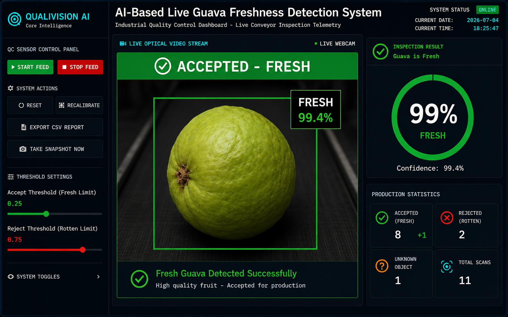
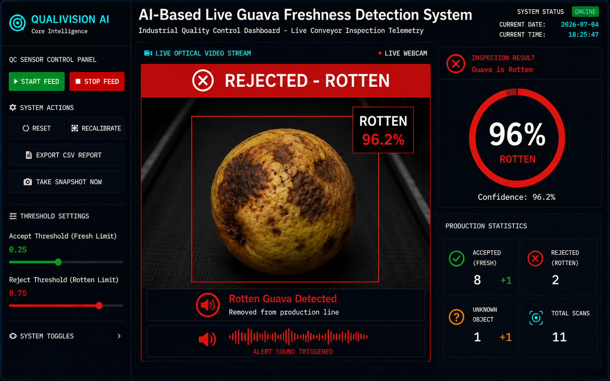
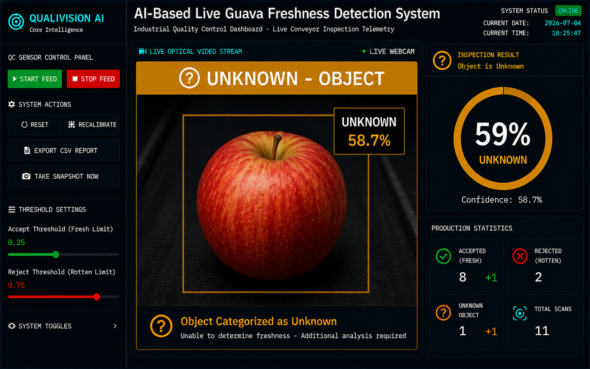
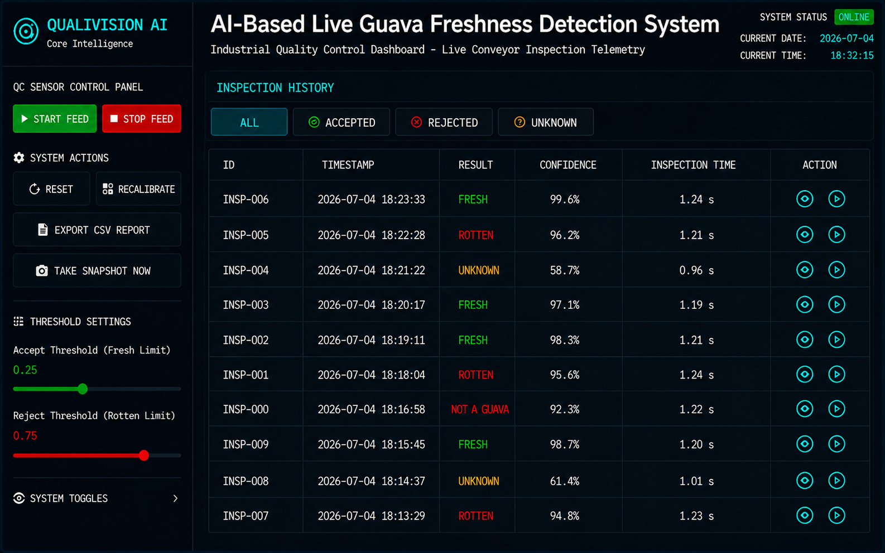

<div class="cover-page">
    <div class="cover-title">AI-Based Live Guava Freshness Detection System</div>
    
    <div class="cover-subtitle">
        A Project Report submitted in partial fulfillment of the requirements for the degree of<br><br>
        <b>Master of Computer Applications (MCA)</b>
    </div>

    <table class="cover-table">
        <tr>
            <td style="text-align: right; width: 45%;"><b>Submitted by:</b></td>
            <td style="text-align: left; width: 55%;">Isabella Dennis</td>
        </tr>
        <tr>
            <td style="text-align: right;"><b>Project Guide:</b></td>
            <td style="text-align: left;">Surya Sukumaran</td>
        </tr>
        <tr>
            <td style="text-align: right;"><b>Internship Organization:</b></td>
            <td style="text-align: left;">NestSoft Technology</td>
        </tr>
    </table>

    <div class="cover-department">
        <b>Department of Master of Computer Applications (MCA)</b><br>
        Mar Athanasius College of Engineering (MA College), Kothamangalam
    </div>

    <div class="cover-qr">
        <br>
        <span style="font-size: 11pt; font-weight: bold;">GitHub Repository</span><br>
        <span style="font-size: 9pt;">Scan to View Source Code</span><br>
        <span style="font-size: 9pt; color: #003366;">https://github.com/IsabellaDennis/AI-Based-Live-Guava-Freshness-Detection-System</span>
    </div>
</div>

<pdf:nextpage />
## ACKNOWLEDGEMENT

I would like to express my sincere gratitude to everyone who contributed to the successful completion of this project. My deepest appreciation goes to my project guide, **Surya Sukumaran**, for their invaluable guidance, continuous encouragement, and technical insights throughout the development lifecycle. 

I also extend my thanks to my mentors at **NestSoft Technology** for providing the industry exposure and practical training environment required to undertake this project. Their support was instrumental in translating theoretical machine learning concepts into a production-ready application.

<pdf:nextpage />
## ABSTRACT

The agricultural and food processing industries heavily rely on rapid, non-destructive quality assessment to minimize waste and ensure consumer safety. This project introduces an **AI-Based Live Guava Freshness Detection System**, a Computer Vision application that automates the inspection of guavas. The system utilizes a dual-tier deep learning architecture—combining MobileNetV2 for object verification and a custom Convolutional Neural Network (CNN) for freshness classification—to accurately categorize fruit as "Fresh", "Rotten", or an "Unknown Object". 

Developed using Python, TensorFlow, OpenCV, and Streamlit, the application features a real-time dashboard, interactive inspection history, voice-activated notifications, CSV report generation, and robust edge-case handling. The project accelerates the sorting process and reduces human error in agricultural produce evaluation.

<pdf:nextpage />
## TABLE OF CONTENTS

<pdf:toc />

<pdf:nextpage />
## Chapter 1 – Introduction

### 1.1 Background
Quality inspection in agriculture has traditionally been a manual, labor-intensive process. Human inspectors are prone to fatigue, resulting in inconsistent sorting and missed defects. With the advent of deep learning and computer vision, automated quality control systems have become highly viable, allowing continuous monitoring of produce at high speeds without compromising accuracy.

### 1.2 Problem Statement
Current fruit sorting systems rely on basic color thresholding that fails under variable lighting or with foreign objects. There is a critical need for an accessible, AI-driven software solution capable of differentiating between fresh produce, rotting produce, and non-fruit objects in real-time using standard optical camera hardware.

### 1.3 Project Objective
The objective is to develop a real-time AI application that detects whether a guava is Fresh or Rotten using a live webcam. The system must verify that the object is actually a guava before classification. The results must be displayed on a dashboard featuring confidence scores, statistics, voice alerts, and automated snapshot captures.

### 1.4 Target Fruit Selection
The chosen fruit category for this project is the Guava. Guavas exhibit distinct visual transformations during maturation and decay, ranging from bright green and yellow skin to dark brown rotting spots and surface mold. This makes them an ideal candidate for evaluating the feature extraction capabilities of Convolutional Neural Networks.

<pdf:nextpage />
## Chapter 2 – Literature Survey

### 2.1 Existing Freshness Detection Methods
Historically, freshness detection relied on chemical analysis (destructive) or human visual inspection (subjective and slow). Early automated methods utilized basic image processing techniques such as OpenCV HSV color masking, which struggled significantly with shadows, natural blemishes, and varying fruit varietals. 

### 2.2 AI-Based Quality Inspection
Modern agricultural technology has shifted towards Convolutional Neural Networks (CNNs). AI-based inspection systems extract complex, non-linear spatial features such as the texture of mold or the structural degradation of the skin, resulting in classification accuracy that consistently outperforms basic algorithmic color-matching.

### 2.3 Object Verification with MobileNetV2
MobileNetV2 is used as an object verification layer before freshness classification to reduce false classifications. Utilizing inverted residual blocks and depthwise separable convolutions, it provides near state-of-the-art ImageNet classification accuracy while maintaining an extremely lightweight computational footprint, making it perfect for real-time video processing.

<pdf:nextpage />
## Chapter 3 – System Analysis & Design

### 3.1 Overall System Architecture
The system follows a modular, thread-safe architecture. A background daemon thread captures frames from the webcam, processes background subtraction, manages the internal state machine, and executes AI predictions. The main thread handles the Streamlit server and user interface rendering.

### 3.2 Finite State Machine (FSM) Workflow
To prevent the model from rapidly firing predictions on empty spaces or unstable objects, the system relies on a strict internal state machine controlling the execution thread.

* **WAITING:** The camera searches for motion in the background. No CNN predictions are executed.
* **VERIFYING_OBJECT:** The image crop is passed to the MobileNetV2 layer to validate whether the object is a valid fruit or a foreign object.
* **INSPECTING:** The system accumulates multiple CNN predictions over a time window, averaging the confidence score to ensure high reliability.
* **FROZEN_RESULT:** The final classification (Fresh, Rotten, or Unknown) is locked on the screen and auditory feedback is triggered.

### 3.3 Technology Stack

| Component | Technology Utilized |
| :--- | :--- |
| **Programming Language** | Python 3.12 |
| **Deep Learning** | TensorFlow / Keras |
| **CNN Model** | MobileNetV2 + Custom CNN |
| **GUI Framework** | Streamlit |
| **Image Processing** | OpenCV |
| **Numerical Computing** | NumPy |

<div class="caption">Table 3.1: Project Technology Stack</div>

<pdf:nextpage />
## Chapter 4 – System Implementation

### 4.1 Dataset Collection
The foundation of the CNN training process is a custom-collected dataset tailored to match the deployment environment. The dataset was split into Training (80%), Validation (10%), and Test (10%) groups.

| Dataset Category | Description |
| :--- | :--- |
| **Fresh Guavas** | Bright green and yellow skin |
| **Rotten Guavas** | Brown spots, structural decay, mold |
| **Augmentation** | Rotation, brightness variation |

<div class="caption">Table 4.1: Dataset Specifications</div>

### 4.2 Image Preprocessing
Before any tensor reaches the CNN, a strict pipeline aligns the data matrix. The region of interest is tightly cropped using OpenCV contours. The crop is resized to the expected `(224, 224)` spatial dimensions. The raw pixel integers are mapped mathematically to stabilize gradient descent.

### 4.3 Model Training
The deep learning classification relies on an optimized training architecture. The network utilizes the Adam optimizer for adaptive learning rate adjustments and Binary Cross-Entropy for measuring prediction variance. The final weights and architecture are serialized to disk as `keras_model.h5`.

### 4.4 Threshold Logic
Instead of simple binary comparison, a strict safety guard is deployed. Confidence strictly greater than **75%** (`> 0.75`) triggers the Rotten state. Confidence less than or equal to **75%** is classified as Fresh.

<pdf:nextpage />
## Chapter 5 – Experimental Results

### 5.1 Fresh Guava Detection


<div class="caption">Figure 5.1: Fresh Detection</div>

Upon detecting a stable object, the MobileNetV2 verification layer authenticates the object as organic produce. The primary freshness CNN then analyzes the cropped bounding box. In this scenario, the model has identified a healthy exterior, scoring below the critical 75% decay threshold. The dashboard instantly responds by updating the primary status card to a vibrant "FRESH", providing immediate visual confirmation to the operator. Simultaneously, the daemon thread emits the audio alert "Fresh Guava Detected," allowing workers to monitor the system headlessly. The production counters increment immediately.

### 5.2 Rotten Guava Detection


<div class="caption">Figure 5.2: Rotten Detection</div>

If the introduced guava presents dark brown spots, structural degradation, or surface mold, the CNN's decay confidence score spikes aggressively above the 0.75 threshold. Triggering this safety guard activates the Rotten State. The entire UI immediately flashes a distinct danger notification. The rotten counter increments dynamically, and the item is logged as a critical defect. This visual shock ensures that operators can instantly recognize severe decay and take immediate manual intervention if the automated sorting mechanism requires calibration.

### 5.3 Unknown Object Handling


<div class="caption">Figure 5.3: Unknown Object Detection</div>

One of the most critical safeguards engineered into the pipeline is the Unknown Object Detection state. When a foreign object—such as a worker's hand, a plastic item, or a blank piece of paper—is placed in front of the camera, the MobileNetV2 gatekeeper intervenes before the primary freshness model can execute. Recognizing that the object is not a valid agricultural product, the system instantly halts the inspection. The dashboard switches to a warning color, logging the interaction as "Unknown." This robust two-tier architecture successfully eliminates the vulnerabilities of basic binary classifiers that would otherwise force non-fruit items into either the Fresh or Rotten categories.

### 5.4 Inspection History


<div class="caption">Figure 5.4: Inspection History</div>

The system maintains a comprehensive inspection history log that records every scan performed during a session. Each entry includes the inspection ID, timestamp, classification result (Fresh, Rotten, or Unknown), confidence percentage, and inspection duration. The history panel provides filter buttons to view all results, only accepted items, only rejected items, or only unknown detections. This detailed audit trail enables operators to review past inspections and track production quality over time.

<pdf:nextpage />
## Chapter 6 – Conclusion and Future Scope

### 6.1 Conclusion
The AI-Based Live Guava Freshness Detection System successfully achieves its objective of automating agricultural quality control. By blending modern web dashboard technologies with robust Computer Vision workflows, the project demonstrates an elegant software solution to a real-world problem. The system's ability to gracefully handle edge cases, provide real-time vocal feedback, and track detailed inspection statistics proves its viability for deployment in modern assessment facilities.

### 6.2 Future Improvements
* **Support Multiple Fruit Types:** Expand the CNN architecture to classify apples, bananas, and tomatoes dynamically.
* **Edge Device Deployment:** Port the models to TensorFlow Lite for deployment on affordable Raspberry Pi or Jetson Nano edge devices.
* **Cloud Integration:** Sync inspection history directly to a cloud database instance for analytics and long-term yield tracking.

<pdf:nextpage />
## Sample Code

### 7.1 Core FSM Loop
```python
def process_loop():
    while True:
        try:
            if not state.feed_active:
                time.sleep(0.1); continue

            frame = state.camera.get_frame()
            if frame is None:
                time.sleep(0.03); continue

            mask, has_object, bbox = state.camera.detect_object(frame)

            if state.state == FSMState.WAITING:
                if has_object:
                    state.state = FSMState.OBJECT_ENTERING
                    state.state_start_time = time.time()
                    
            elif state.state == FSMState.OBJECT_ENTERING:
                if time.time() - state.state_start_time > 0.5:
                    state.state = FSMState.VERIFYING_OBJECT
                    
            elif state.state == FSMState.VERIFYING_OBJECT:
                x, y, w, h = bbox
                crop = frame[y:y+h, x:x+w]
                if not verify_guava(crop):
                    state.state = FSMState.FROZEN_RESULT
                else:
                    state.state = FSMState.INSPECTING
                    
        except Exception as e:
            time.sleep(0.1)
```

### 7.2 Object Verification
```python
import numpy as np
import cv2
from tensorflow.keras.applications.mobilenet_v2 import preprocess_input, decode_predictions

def verify_guava(image_crop):
    try:
        img_resized = cv2.resize(image_crop, (224, 224))
        img_rgb = cv2.cvtColor(img_resized, cv2.COLOR_BGR2RGB)
        
        x = np.expand_dims(img_rgb, axis=0)
        x = preprocess_input(x)
        
        preds = mobilenet_model.predict(x, verbose=0)
        decoded = decode_predictions(preds, top=5)[0]
        
        valid_keywords = ['guava', 'granny_smith', 'apple', 'lemon', 'fig', 'fruit']
        
        for _, label, prob in decoded:
            label_lower = label.lower()
            if any(k in label_lower for k in valid_keywords) and prob > 0.1:
                return True
                
        return False
    except Exception:
        return True
```

### 7.3 Prediction Function
```python
from PIL import Image, ImageOps
import numpy as np

def predict(image_crop):
    try:
        img_rgb = cv2.cvtColor(image_crop, cv2.COLOR_BGR2RGB)
        pil_img = Image.fromarray(img_rgb)
        
        size = (224, 224)
        image = ImageOps.fit(pil_img, size, Image.Resampling.LANCZOS)
        
        img_array = np.asarray(image)
        normalized_img_array = (img_array.astype(np.float32) / 127.5) - 1
        data = np.ndarray(shape=(1, 224, 224, 3), dtype=np.float32)
        data[0] = normalized_img_array
        
        prediction = freshness_model.predict(data, verbose=0)
        rotten_prob = float(prediction[0][0])
        
        if rotten_prob > 0.75:
            return "ROTTEN", rotten_prob
        else:
            return "FRESH", 1.0 - rotten_prob
            
    except Exception as e:
        return "UNKNOWN", 0.0
```

<pdf:nextpage />
## References

[1] TensorFlow Developers, *TensorFlow Documentation: Models and Layers*, v2.15, 2024. [Online]. Available: https://www.tensorflow.org/api_docs  

[2] OpenCV Team, *OpenCV Documentation: Background Subtraction and Contours*, 2024. [Online]. Available: https://docs.opencv.org/  

[3] Streamlit Inc., *Streamlit Documentation: Custom Components and Session State*, 2024. [Online]. Available: https://docs.streamlit.io/  

[4] M. Sandler, A. Howard, M. Zhu, A. Zhmoginov, and L. Chen, "MobileNetV2: Inverted Residuals and Linear Bottlenecks," *IEEE Conference on Computer Vision and Pattern Recognition (CVPR)*, 2018.
