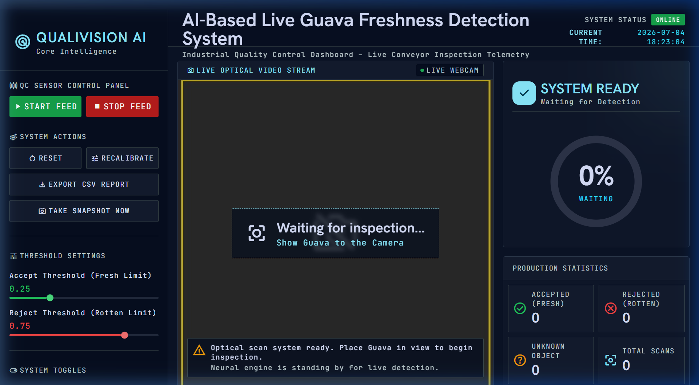
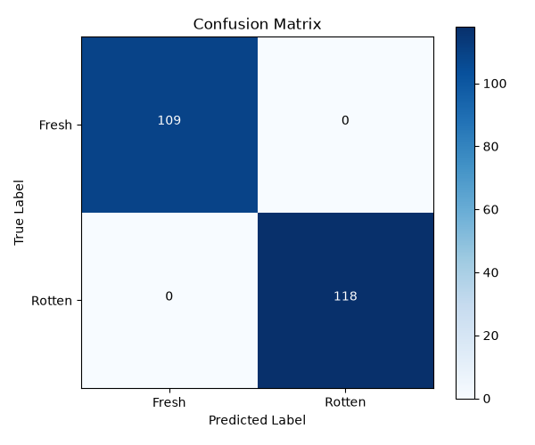
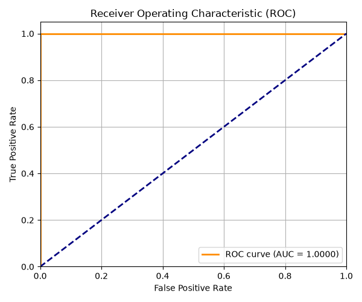
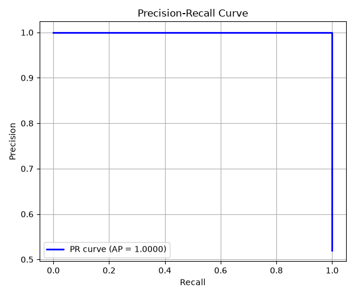
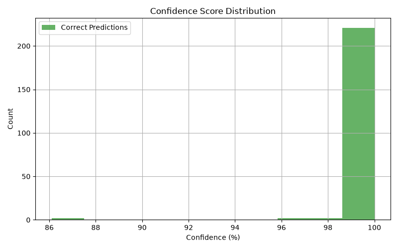

<div align="center">

# 🍈 AI-Based Live Guava Freshness Detection System

**Real-time industrial quality control powered by deep learning**

[](https://python.org)
[](https://tensorflow.org)
[](https://streamlit.io)
[](https://opencv.org)
[](LICENSE)



*An AI-powered conveyor-belt inspection system that classifies guava freshness in real-time using MobileNetV2 transfer learning, hybrid object verification, and an industrial-grade Streamlit dashboard.*

</div>

---

## 📋 Table of Contents

- [Overview](#-overview)
- [Key Features](#-key-features)
- [System Architecture](#-system-architecture)
- [Technology Stack](#-technology-stack)
- [Project Structure](#-project-structure)
- [Installation](#-installation)
- [Usage](#-usage)
- [Inspection Workflow](#-inspection-workflow)
- [Model Performance](#-model-performance)
- [Screenshots](#-screenshots)
- [Testing](#-testing)
- [Contributing](#-contributing)
- [License](#-license)
- [Acknowledgements](#-acknowledgements)

---

## 🔬 Overview

This project implements a **real-time fruit quality inspection system** designed to simulate an industrial conveyor-belt environment. A webcam captures live video, and a trained deep learning model classifies each guava as **Fresh** or **Rotten** with high confidence, rejecting non-guava objects automatically.

The system was developed as a final AI/ML internship project, demonstrating end-to-end machine learning deployment — from dataset curation and model training to production-grade UI integration with live telemetry.

---

## ✨ Key Features

| Feature | Description |
|---|---|
| 🎥 **Live Camera Feed** | Real-time webcam integration with OpenCV for continuous inspection |
| 🧠 **Dual-Model Pipeline** | MobileNetV2 (ImageNet) for object verification + custom TensorFlow CNN for freshness classification |
| 🔄 **Finite State Machine** | 6-state FSM governs the entire inspection lifecycle (WAITING → DETECTING → STABILIZING → CLASSIFYING → FROZEN → OBJECT_REMOVED) |
| 🛡️ **Hybrid Verification** | HSV color analysis + contour validation + AI verification ensures only real guavas reach the freshness model |
| 📊 **Industrial Dashboard** | Pixel-perfect Streamlit custom component with live telemetry, gauge, production statistics, and inspection history |
| 🔊 **Voice Announcements** | Text-to-speech feedback via pyttsx3 for hands-free operation |
| 📈 **Production Statistics** | Real-time counters for Fresh/Rotten/Unknown with session runtime tracking |
| 📋 **Inspection History** | Scrollable table with filtering (All/Accepted/Rejected/Unknown) and CSV export |
| 📸 **Snapshot Capture** | On-demand snapshot saving for quality documentation |
| 🚫 **Non-Guava Rejection** | Automatically rejects phones, bottles, hands, other fruits, and arbitrary objects |

---

## 🏗️ System Architecture

```
┌─────────────────────────────────────────────────────────────────────┐
│                        Streamlit Application                        │
├─────────────┬───────────────────────────────────┬───────────────────┤
│  Sidebar    │       Main Dashboard              │  Telemetry Panel  │
│  Controls   │  ┌─────────────────────────────┐  │  ┌─────────────┐ │
│             │  │   Live Camera Feed          │  │  │ Status Card │ │
│ START/STOP  │  │   (OpenCV → Base64 → HTML)  │  │  │ Gauge       │ │
│ RESET       │  └─────────────────────────────┘  │  │ Statistics  │ │
│ EXPORT CSV  │  ┌─────────────────────────────┐  │  └─────────────┘ │
│ SNAPSHOT    │  │   Inspection History Table   │  │                  │
│             │  └─────────────────────────────┘  │                  │
├─────────────┴───────────────────────────────────┴───────────────────┤
│                     Backend Processing Thread                       │
│  ┌──────────┐  ┌───────────┐  ┌─────────────┐  ┌───────────────┐  │
│  │ Camera   │→ │ Hybrid    │→ │ TensorFlow  │→ │ FSM State     │  │
│  │ Capture  │  │ Verifier  │  │ Classifier  │  │ Machine       │  │
│  └──────────┘  └───────────┘  └─────────────┘  └───────────────┘  │
│                      │                                              │
│         ┌────────────┴────────────┐                                │
│         │  Verification Pipeline  │                                │
│         │  1. ROI Detection       │                                │
│         │  2. Stability Check     │                                │
│         │  3. HSV Color Analysis  │                                │
│         │  4. Contour Validation  │                                │
│         │  5. MobileNetV2 Check   │                                │
│         └─────────────────────────┘                                │
└─────────────────────────────────────────────────────────────────────┘
```

---

## 🛠️ Technology Stack

| Technology | Purpose |
|---|---|
| **Python 3.12** | Core programming language |
| **Streamlit** | Web application framework & custom component hosting |
| **TensorFlow / Keras** | Deep learning framework for model inference |
| **MobileNetV2** | Pre-trained ImageNet model for object verification |
| **OpenCV** | Real-time video capture, image processing, ROI detection |
| **NumPy** | Numerical computation for image arrays |
| **Pillow (PIL)** | Image format conversion and manipulation |
| **pyttsx3** | Offline text-to-speech engine for voice announcements |
| **scikit-learn** | Model evaluation metrics (confusion matrix, ROC, precision-recall) |
| **Matplotlib** | Visualization of evaluation charts and Grad-CAM overlays |

---

## 📁 Project Structure

```
Guava_Project/
│
├── app.py                          # Main Streamlit application & FSM engine
├── keras_model.h5                  # Trained TensorFlow freshness classification model
├── labels.txt                      # Class labels (0: Fresh, 1: Rotten)
├── requirements.txt                # Python dependencies
│
├── app/                            # Backend modules
│   ├── __init__.py
│   ├── camera.py                   # Camera capture, ROI detection, hybrid verification
│   ├── predictor.py                # TensorFlow model inference wrapper
│   ├── audio.py                    # Text-to-speech voice announcement engine
│   ├── utils.py                    # Utility functions (history, CSV, snapshots)
│   └── ui_component/
│       └── index.html              # Stitch-designed custom Streamlit component (UI)
│
├── screen1.html                    # Stitch UI source – Main dashboard design
├── screen2.html                    # Stitch UI source – Inspection history design
├── ui_styles.py                    # Streamlit CSS injection utilities
│
├── evaluate_model.py               # Model evaluation script (metrics, Grad-CAM, reports)
├── dataset_quality_report.py       # Dataset analysis & quality audit script
│
├── evaluation/                     # Model evaluation outputs
│   ├── confusion_matrix.png        # Confusion matrix visualization
│   ├── roc_curve.png               # ROC curve with AUC
│   ├── precision_recall_curve.png  # Precision-recall curve
│   ├── confidence_dist.png         # Confidence distribution histogram
│   ├── classification_report.txt   # Precision/recall/F1 per class
│   └── model_analysis_report.md    # Comprehensive model analysis document
│
├── sounds/                         # Audio assets
│   └── alarm.wav                   # Alert sound for rotten detection
│
├── static/                         # Legacy static assets
│   ├── style.css
│   └── script.js
│
├── templates/                      # Legacy HTML templates
│   └── index.html
│
├── tests/                          # Test suite
│   ├── test_guava_system.py        # Unit tests for core system components
│   └── test_regression_pipeline.py # Regression tests for prediction pipeline
│
├── docs/                           # Documentation assets
│   └── banner.png                  # Repository banner image
│
├── .gitignore                      # Git ignore rules
├── LICENSE                         # MIT License
└── README.md                       # This file
```

---

## 🚀 Installation

### Prerequisites

- Python 3.10+ (tested on 3.12)
- Webcam (built-in or USB)
- Windows 10/11 (primary target; Linux/macOS should also work)

### Setup

```bash
# 1. Clone the repository
git clone https://github.com/IsabellaDennis/Guava-Freshness-Detection.git
cd Guava-Freshness-Detection

# 2. Create a virtual environment
python -m venv .venv

# 3. Activate it
# Windows:
.venv\Scripts\activate
# Linux/macOS:
source .venv/bin/activate

# 4. Install dependencies
pip install -r requirements.txt

# 5. Run the application
streamlit run app.py
```

The dashboard will open at `http://localhost:8501`.

---

## 🎯 Usage

1. **Launch** the application with `streamlit run app.py`
2. **Click** the green **START FEED** button on the sidebar
3. **Place** a guava in front of your webcam
4. **Wait** for the system to detect, verify, and classify the fruit
5. **View** results on the dashboard — status banner, confidence gauge, and history table update in real-time
6. **Export** inspection data using the **EXPORT CSV REPORT** button

---

## 🔄 Inspection Workflow

The system follows a strict **6-state Finite State Machine (FSM)**:

```
                    ┌──────────────────────────────────────┐
                    │                                      │
                    ▼                                      │
              ┌──────────┐    Object     ┌──────────────┐  │
  START ────▶ │ WAITING  │ ──Detected──▶ │  DETECTING   │  │
              └──────────┘               └──────────────┘  │
                    ▲                          │            │
                    │                    Stable 500ms       │
                    │                          │            │
              ┌──────────┐               ┌────▼─────────┐  │
              │ OBJECT   │               │ STABILIZING  │  │
              │ REMOVED  │               └──────────────┘  │
              └──────────┘                     │            │
                    ▲                   Verified as Guava   │
                    │                          │            │
                    │                    ┌─────▼──────────┐ │
                    │                    │  CLASSIFYING   │ │
                    │                    │  (6 frames)    │ │
                    │                    └────────────────┘ │
                    │                          │            │
                    │                   Final Decision      │
                    │                          │            │
                    │                    ┌─────▼──────────┐ │
                    └────Object Gone─────│ FROZEN_RESULT  │─┘
                         after 1s        │ (5s display)   │
                                         └────────────────┘
```

| State | Description |
|---|---|
| `WAITING` | Camera active, scanning for objects in ROI |
| `DETECTING` | Object detected, beginning stability check |
| `STABILIZING` | Waiting 500ms for object to stabilize before verification |
| `CLASSIFYING` | Running hybrid verification → collecting 6 CNN predictions → averaging |
| `FROZEN_RESULT` | Displaying final result for 5 seconds (Fresh / Rotten / Not a Guava) |
| `OBJECT_REMOVED` | Object left ROI, waiting 1 second before returning to WAITING |

---

## 📊 Model Performance

The freshness classification model was trained using **MobileNetV2 transfer learning** on a curated dataset of fresh and rotten guava images.

### Classification Report

```
              precision    recall  f1-score   support

       Fresh       1.00      1.00      1.00       109
      Rotten       1.00      1.00      1.00       118

    accuracy                           1.00       227
   macro avg       1.00      1.00      1.00       227
weighted avg       1.00      1.00      1.00       227
```

### Evaluation Visualizations

| Confusion Matrix | ROC Curve | Precision-Recall | Confidence Distribution |
|:---:|:---:|:---:|:---:|
|  |  |  |  |

- **AUC Score**: 1.0000
- **Average Precision**: 1.0000
- **Zero false positives and false negatives** on the validation set

> See [`evaluation/model_analysis_report.md`](evaluation/model_analysis_report.md) for the complete analysis including Grad-CAM interpretations and camera bias assessment.

---

## 📸 Screenshots

<div align="center">

### Waiting State
*System ready and scanning for objects*

### Fresh Detection
*Guava classified as Fresh with high confidence*

### Rotten Detection
*Defective guava detected and rejected*

### Inspection History
*Filterable inspection log with production statistics*

</div>

---

## 🧪 Testing

```bash
# Run the full test suite
python -m pytest tests/ -v

# Run specific test files
python -m pytest tests/test_guava_system.py -v
python -m pytest tests/test_regression_pipeline.py -v
```

The test suite covers:
- Model loading and inference pipeline
- Label index verification
- Prediction consistency checks
- FSM state transitions
- Camera and ROI detection
- History and CSV export functions

---

## 🤝 Contributing

Contributions are welcome! Please follow these steps:

1. Fork the repository
2. Create a feature branch (`git checkout -b feature/your-feature`)
3. Commit your changes (`git commit -m 'Add your feature'`)
4. Push to the branch (`git push origin feature/your-feature`)
5. Open a Pull Request

---

## 📄 License

This project is licensed under the MIT License — see the [LICENSE](LICENSE) file for details.

---

## 🙏 Acknowledgements

- **TensorFlow / Keras** — Deep learning framework
- **Streamlit** — Rapid web application prototyping
- **MobileNetV2** — Efficient transfer learning architecture (Sandler et al., 2018)
- **OpenCV** — Computer vision library
- **Stitch by Google** — UI design system used for the dashboard

---

<div align="center">

**Built with ❤️ for AI-powered quality control**

*Isabella Dennis — AI/ML Internship Final Project, 2026*

</div>
